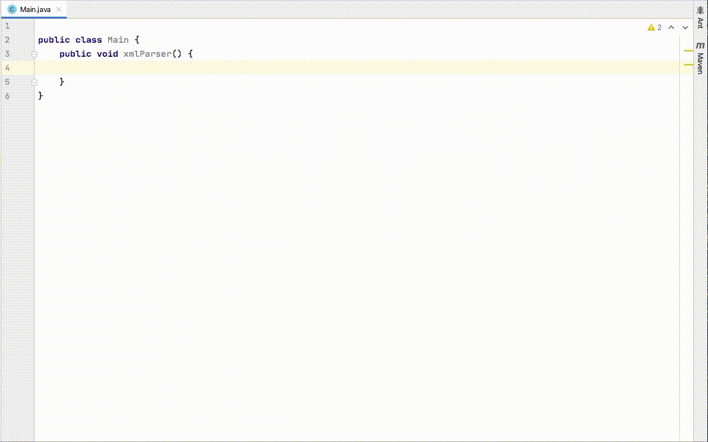
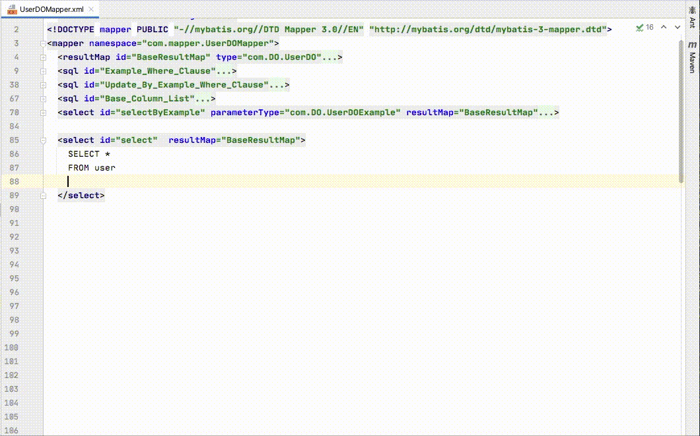

## MOMO CODE SEC INSPECTOR

本插件作为Java项目静态代码安全审计工具，侧重于在编码过程中发现项目潜在的安全风险，并提供一键修复能力。

本插件利用IDEA原生Inspection机制检查项目，自动检查当前活跃窗口的活跃文件，检查速度快，占用资源少。

插件提供的规则名称均以"<b>Momo</b>"开头。

### 目录

1. [版本支持](#版本支持)
2. [效果展示](#效果展示)
3. [安装使用](#安装使用)
3. [贡献代码](#贡献代码)
4. [注意事项](#注意事项)
5. [关于我们](#关于我们)


### 版本支持

Intellij IDEA ( Community / Ultimate ) 

- 2017.3
- 2018.1
- 2018.2
- 2018.3
- 2019.1
- 2019.2
- 2019.3
- 2020.1
- 2020.2


### 效果展示

**演示一： XXE漏洞发现与一键修复**



**演示二： Mybatis XML Mapper SQL注入漏洞发现与一键修复**




### 安装使用


### 贡献代码

#### 项目结构

```
src
├── main
│   ├── java
│   │   └── com
│   │       └── immomo
│   │           └── momosec
│   │               ├── aspect
│   │               ├── entity
│   │               ├── fix
│   │               ├── lang
│   │               │   ├── java
│   │               │   │   ├── rule
│   │               │   │   │   └── momosecurity
│   │               │   │   │       └── {InspectionName}.java
│   │               │   │   └── utils
│   │               │   └── xml
│   │               │       └── rule
│   │               │           └── momosecurity
│   │               │               └── {InspectionName}.java
│   │               └── utils
│   └── resources
│       ├── META-INF
│       │   ├── description.html
│       │   ├── pluginIcon.svg
│       │   └── plugin.xml
│       └── inspectionDescriptions
│           └── {InspectionName}.html
└── test
    ├── java
    │   └── com
    │       └── immomo
    │           └── momosec
    │               └── lang
    │                   ├── java
    │                   │   ├── fix
    │                   │   └── rule
    │                   │       └── momosecurity
    │                   │           └── {InspectionName}Test.java
    │                   └── xml
    │                       └── rule
    │                           └── momosecurity
    │                               └── {InspectionName}Test.java
    ├── resources
    └── testData
        └── lang
            ├── java
            │   └── rule
            │       └── momosecurity
            │           └── {InspectionName}
            │               └──...
            └── xml
                └── rule
                    └── momosecurity
                        └── {InspectionName}
                            └──...
```

#### 单元测试

```shell script
> ./gradlew :test
```

#### 预发布打包

1. PLUGIN_BAN_CONST=true ./gradlew --no-daemon clean build -PMOMO_CODE_SEC_INSPECTOR_ENV=pre
2. build/distributions/*.zip 为待发布插件

预发布情况下，插件上报地址写于`src/main/resources/properties/pre.properties`

#### 发布打包

1. PLUGIN_BAN_CONST=true ./gradlew --no-daemon clean build -PMOMO_CODE_SEC_INSPECTOR_ENV=prod
2. build/distributions/*.zip 为待发布插件

正式发布情况下，插件上报地址写于`src/main/resources/properties/prod.properties`


### 注意事项

- 分支命名规则：

以版本号命名的分支，原则上代表支持的idea版本下限。

如branch为2018.3代表当前分支支持版本范围是>=2018.3 (或说from 183.* to *)。

插件具体支持idea版本范围见`gradle.properties`中`idea_since_build`与`idea_until_build`部分。

- 插件版本号命名规则：

原则上，插件版本号以支持的idea版本下限为大版本编号。

如插件当前版本为`x.1`，`x`为开发时所用IDEA版本编号，`.1`为插件发布版本。

需要注意的是，因IDEA更新机制问题，插件新版本号只能**向上增长**。

具体见`gradle.properties`的`plugin_version`字段。

- 版本号对应关系

|分支名|插件版本|IDEA版本|
|---|---|---|
|2018.3|193|2018.3.* <= x|
|2017.3|173|2017.3.* <= x <= 2018.2.*|

- JetBrains PLugins Marketplace 版本

发布到插件市场的版本不支持漏洞上报功能。

发布到插件市场的版本不支持白名单签名下发功能。


### 关于我们


> 陌陌安全致力于以务实的工作保障陌陌旗下所有产品及亿万用户的信息安全，以开放的心态拥抱信息安全机构、团队与个人之间的共赢协作，以自由的氛围和丰富的资源支撑优秀同学的个人发展与职业成长。


Website：https://security.immomo.com

WeChat:

<br>